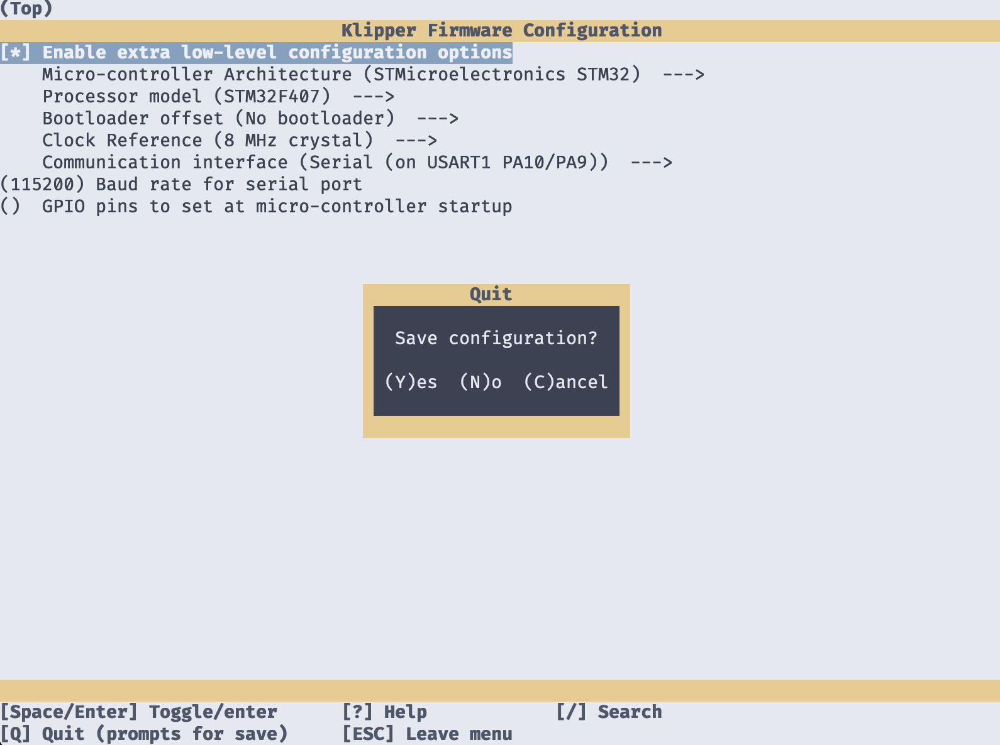

# Labists/Anet ET4 Klipper Guide

# Motivation

The Labists/Anet ET4 is a entry-level low-budget FDM 3D printer.
Although it is not that popular anymore (or ever was), it can be found for just
a few bucks on craigslist or similar websites.

You can find some information on the model at their respective shop sites:
[Anet Shop - Anet ET4](https://shop.anet3d.com/products/official-anet-et4-3d-printer)
[Labists Shop - Labists ET4](https://labists.com/collections/3d-printing/products/3d-printer-et4-diy-kit)

I found a lot of these printers at a nearby outlet store, which sold these as
partially defective units which apparently came from Amazon RMAs - at the
exciting price of only €35.00 per unit - which meant even the stepper motors
alone should be worth more than the unit price.

In this guide, we will go through the steps to make this printer ready for
everyday use with the Klipper firmware, as the preinstalled firmware is not even
in a remotely acceptable state.

The printer can greatly benefit from the Klipper firmware:

- With Klipper, the printer becomes configurable
- Better performance due to Klipper's features and compensations
- The printer is built quite strongly for the price, so it can handle some speed
- A cheap/old printer doesn't go to waste this way

# Contributing

Did you find better settings? Is there something obviously wrong with this
guide?
In any case, feel free to open an issue or even a pull request.
Let's have chat about it!

# Bill of Materials

## Required

- Labists or Anet ET4 Printer
- Either:
  - Raspberry Pi 3 or newer
  - Raspberry Pi Zero 2 W (+USB OTG Adapter)
- USB power cable for the Raspberry Pi
- SD card (at least 4GB) for the Raspberry Pi
- USB-A to USB-B cable
- ST-LINK USB dongle (only needed once for flashing)

## Optional

- Raspberry Pi CSI Camera or any other USB Webcam
- 5V step-down voltage regulator board to power the Raspberry Pi.
  There are many variants available on Amazon. Some have USB ports, some need to
  be soldered - just make sure they can handle at least 24 volts.

# Step 1: Getting MainsailOS on a Raspberry Pi

This one should be almost self-explanatory. Grab yourself a Raspberry Pi 3 or
newer - or in my case - a Raspberry Pi Zero 2 W, and install MainsailOS on it.
My choice of a Pi Zero 2 just boils down to cost - this way it is slightly less
expensive than what I paid for the whole printer.

You can also find a guide on how to install MainsailOS at the official
[MainsailOS documentation](https://docs-os.mainsail.xyz).

1. Download the [Raspberry Pi Imager](https://www.raspberrypi.com/software)
2. Choose OS -> Other specific-purpose OS -> 3D printing -> MainsailOS
3. Choose Stroage -> Select your SD card
4. Flash the OS to the SD card
5. Look up the SD card in your Explorer / Finder
6. If you want to set up WiFi:
   1. Search for `wpa_supplicant.conf.example`, rename it to
      `wpa_supplicant.conf`
   2. Edit `wpa_supplicant.conf` with Notepad, Notepad++ or TextEdit so it
      contains your WiFi credentials. You only have to change the SSID and
      Passphrase in most cases.
7. Attach the USB cable from the Raspberry Pi to the USB port of the printer.
8. Start up the Raspberry Pi with the SD card inserted.
9. Figure out which IP address it has been assigned to by your router.

# Step 2: Compiling Klipper

1. Connect to your Raspberry Pi via SSH, using PuTTY or your preferred terminal.
2. Type in `cd ~/klipper/` to go to the Klipper directory
3. Type in `make menuconfig` to configure the options we want to compile klipper
   with.
4. Set the following options:
   - Enable extra low-level configuration options: **yes**
   - Micro-controller Architecture: **STMicroelectronics STM32**
   - Processor model: STM32F**407**
   - Bootloader offset: **No bootloader**
   - Clock reference: **8 MHz crystal**
   - Communication interface: **Serial (on USART1 PA10/PA9)**
   - Baud rate for serial port: **115200**<br>
     The baud rate is limited to 115200 instead of Klipper's default of 250000
     because the USB-to-Serial chip on the ET4 mainboard is a CH430**G** that
     cannot exceed the speed of 115200 baud. So far, this has worked fine for me.
5. The menu then should look like this:
   
   Press <kbd>Q</kbd> to exit, <kbd>Y</kbd> to save.
6. Compile the firmware by typing `make`, this will take a minute.
7. Download [WinSCP](https://winscp.net/eng/download.php) to connect to your Pi.
   You can use your standard SSH credentials to connect, and then copy over your
   compiled firmware from `~/klipper/out/klipper.bin`.

   On linux and macOS, you can also use the `scp` terminal command to retrieve
   the file:

   ```bash
   scp pi@192.168.0.10:~/klipper/out/klipper.bin ./klipper-et4.bin
   ```

# Step 3: Flashing Klipper to the ET4 Mainboard

The main problem with the ET4 is that the mainboard does not support flashing of
arbitrary firware files via SD card or via USB. This is due to the STM32F407
microcontroller not being directly connected to the native USB pins. For
whatever reason, the engineers decided to connect a USB-to-serial chip in
between the USB port and the STM32F407 MCU.

As the firmware also does not allow to flash just any .bin file, there is only
one option left: flashing via the Serial Wire Debug (SWD) interface, which is
usually meant for debugging while developing the hardware, or factory
programming of the mainboard.

In order to flash something via the SWD interface, you will need to buy an
ST-LINK USB dongle, you can find clones of it on Amazon for under €10.
In my case, I used a clone of the ST-LINK V2.

This ST-LINK dongle is only needed once to install klipper to the mainboard.
If you want to update Klipper in the future though, you will have to use the
same method again. Someone ported the
[OpenBLT bootloader to the ET4 mainboard](https://github.com/davidtgbe/openblt),
but I did not try that yet - maybe it would be possible to flash Klipper via the
existing USB-Serial bridge with that.

> I also tried using a Raspberry Pi Pico with the PicoProbe and YaPicoProbe
> firmwares as an SWD flashing tool together with PyOCD, sadly it just is not
> able to detect the STM32 MCU. If you have any idea how to get it working
> correctly, please open an issue or contribute a pull request.

1.  Download and open the ST-LINK utility from the [ST Website](https://www.st.com/en/development-tools/stsw-link004.html).
2.  Attach the ST-LINK cables to the GND, SWCLK and SWDIO pins.
3.  Open up the printer and locate the J2 header, this is the SWD interface.
4.  Attach the ST-LINK cables to the J2 header. There should be G (ground) and U
    (power) labels. The pin located nearest to the MCU is ground, followed by
    SWCLK and after that SWDIO.
5.  Plug the ST-LINK dongle into the USB port of your computer.
6.  Power the printer up by plugging it into mains voltage.
7.  Press and hold down the white reset switch.
8.  Press "Connect" inside the ST-LINK utility.
9.  Release the reset switch. The ST-LINK utility should now establish a
    connection to the MCU.
10. Go to Target -> Program.
11. Select the `klipper-et4.bin` file you copied earlier.
12. Click "Start" to start the flashing process.
13. After the process has been finished, please fully remove and reattach power
    to the printer. This way the new firmware is correctly booted.

# Step 4: Configuring Klipper

1. Upload [printer.cfg](configs/printer.cfg) to the config directory via the
   Mainsail web interface.
2. Make sure to check if your serial port is correctly set.
   You can check for available serial ports by typing this command in the
   terminal of your Raspberry Pi:
   ```bash
   ls -lah /dev/serial/by-id/
   ```

# Step 5: Setting up your Slicer

Add a new profile for the printer. Anything close to the Creality Ender-3 or the
Prusa MK2 / MK3 should work.
I can really recommend
[OrcaSlicer](https://github.com/SoftFever/OrcaSlicer/releases)
as a modern slicer that integrates very well with Klipper and has a lot of
modern slicing features.

1. Create a new Printer profile in your slicer. You can start with something
   like the Prusa MK3S or an Ender-3 as the baseline.
2. For my purposes, I changed the following settings for the printer profile.
   Be aware that they might be called differently for each slicer software.
   - Print Area: **210mm x 210mm**
   - Printable height: **250mm**
   - Retraction length: **4mm**
   - Retraction speed: **35mm/s**
   - Detraction speed: **35mm/s**
   - Z hop: **enabled**
   - Z hop distance: **0.2mm**
   - Maximum speed X: **300mm/s**
   - Maximum speed Y: **300mm/s**
   - Maximum speed Z: **12mm/s**
   - Maximum speed E: **25mm/s**
   - Maximum acceleration:
     - For the glass bed: **1900mm/s^2**
     - For the stick-on plastic sheet: **2900mm/s^2**
3. Adjust your slicer printer profile to use the correct start and end gcodes.
   You can either let the slicer control those manually, or use the widely
   common start/end macros used with Klipper.
4. For your convenience, [easyprofile.cfg](configs/easyprofile.cfg) can be used
   to get those macros. This is a more sophisticated version of the
   `START_PRINT` and `END_PRINT` macro bundle you can find floating around on
   the internet, with additional support for
   [KAMP](https://github.com/kyleisah/Klipper-Adaptive-Meshing-Purging).
   To use it, just include it in your `printer.cfg` after you uploaded it via
   the Mainsail web interface:

   ```ini
   [include easyprofile.cfg]
   ```

   To make it work with the slicer, use the following start/end gcodes with
   your slicer:

   **Cura**

   > For Cura, you should consider installing the
   > [Klipper Preprocessor](https://github.com/pedrolamas/klipper-preprocessor)
   > plugin.

   Start:

   ```gcode
   START_PRINT BED_TEMP={material_bed_temperature_layer_0} EXTRUDER_TEMP={material_print_temperature_layer_0}
   ```

   End:

   ```gcode
   END_PRINT
   ```

   **PrusaSlicer**
   Start:

   ```gcode
   M104 S0
   M140 S0
   SET_PRINT_STATS_INFO TOTAL_LAYER=[total_layer_count]
   START_PRINT BED_TEMP={first_layer_temperature[0]} EXTRUDER_TEMP={first_layer_temperature[0]}
   ```

   Before layer change:

   ```gcode
   ;BEFORE_LAYER_CHANGE
   ;[layer_z]
   G92 E0
   ```

   After layer change:

   ```gcode
   ;AFTER_LAYER_CHANGE
   ;[layer_z]
   SET_PRINT_STATS_INFO CURRENT_LAYER={layer_num + 1}
   ```

   End:

   ```gcode
   ; total layers count = [total_layer_count]
   END_PRINT
   ```

   **OrcaSlicer**
   Start:

   ```gcode
   M104 S0
   M140 S0
   SET_PRINT_STATS_INFO TOTAL_LAYER=[total_layer_count]
   START_PRINT BED_TEMP=[bed_temperature_initial_layer_single] EXTRUDER_TEMP=[nozzle_temperature_initial_layer]
   ```

   Before layer change:

   ```gcode
   ;BEFORE_LAYER_CHANGE
   ;[layer_z]
   G92 E0
   ```

   After layer change:

   ```gcode
   ;AFTER_LAYER_CHANGE
   ;[layer_z]
   SET_PRINT_STATS_INFO CURRENT_LAYER={layer_num + 1}
   ```

   End:

   ```gcode
   END_PRINT
   ; total layers count = [total_layer_count]
   ```

# Step 6: Calibrating the Printer

## Resonance compensation

The supplied configuration files include resonance compensation parameters for
the glass bed as well as the stick-on plastic sheet bed. Please make sure to
comment out the one you are not using. By default, the glass bed parameters are
enabled, as the printer ships like that. I recommend to use the stick-on plastic
sheet though.

## Pressure advance

Pressure advance was tuned for the factory extruder, with the default bowden
tube length of about 30cm. If you changed anything about the extruder or the
bowden tube, you should disable pressure advance and re-calibrate it.

## Z-Offset

1. Make sure the probe triggers a detection before the nozzle hits the bed.
   For me, about 3mm distance worked fine. To adjust the triggering distance,
   turn the screw on top of the probe until the light comes on when the extruder
   is at the height where the probe should trigger.
2. Home the printer on all axes.
3. Slide a sheet of paper on the bed, so the nozzle hovers over it.
4. Set the Z-height to 0 via the Mainsail web interface.
5. Use the Z-offset widget to move the nozzle up or down until the paper slides
   with just a little resistance by the nozzle.
6. Save the configuration.

## Bed Mesh Leveling

Bed Mesh Leveling is pre-configured for optimal reliability. The probe that
comes with the printer from the factory is not always that reliable in terms of
repeatable measurements, so I took that fact into account for the probe
configuration.

Please make sure to level the bed with the help of the height map inside the
Mainsail web interface.

# 3D Models

For your convenience, I created some models to enhance the experience when
modifying the ET4 to use Klipper. Mainly this consists of a bezel for the
touch LCD that is not needed anymore which provides mounting points for a
Raspberry on the inside, and a camera holder on the outside.

You can find all models on the corresponding [Printables page](https://printables.com/model/613881).

**Please make sure to like the design and maybe add it to a collection to help me
get some Prusameters in return - that helps me finance my private projects and
other prototyping efforts.**

# Credits

I have compiled some other resources I have found online to create this batteries-included guide. Thanks to these people, I didn't have to figure out
large parts of the configuration.

- PHeNNeT FiLM - [Blog post](https://phennet-film.blogspot.com/2021/05/anet-et4-printercfg-this-setting-i-dont.html) / [YouTube guide](https://www.youtube.com/watch?v=I6TtREwd0Yc)
- 3D Print Wiki config - [Wiki page](https://3dprint.wiki/reprap/anet/et4/setup-and-flash-klipper)
- Gluboy config - [Thingiverse page](https://www.thingiverse.com/thing:5324996)
